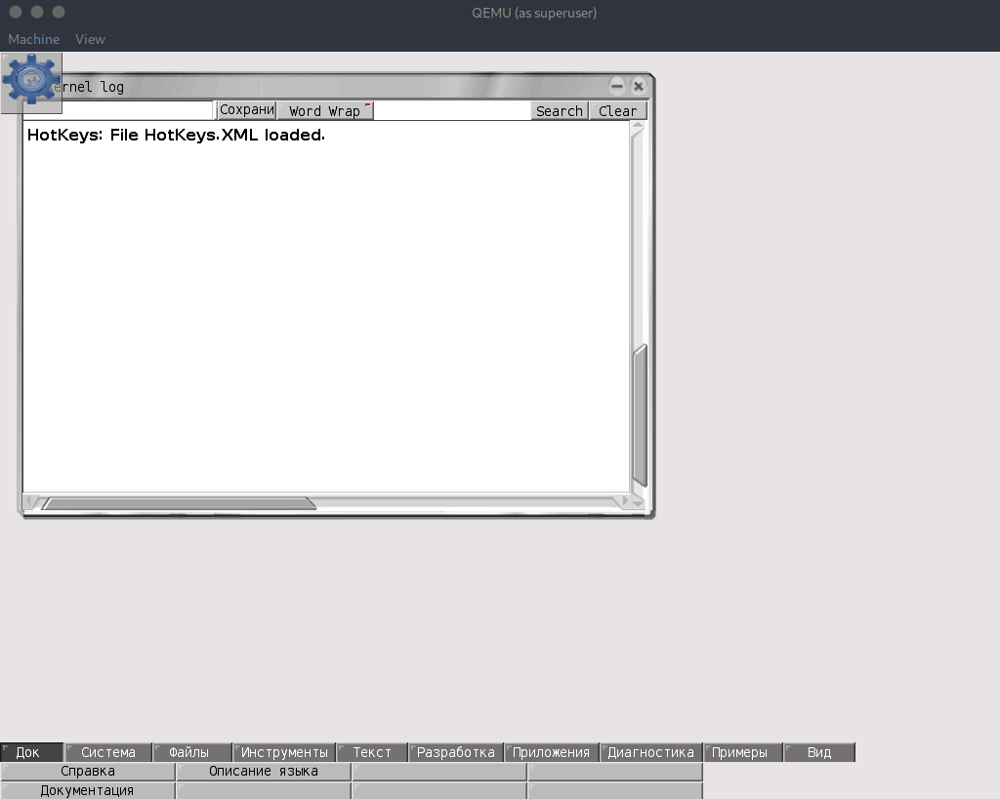

# Яр_ОС_Лав

## Описание
> Широко распространено мнение, что английский является международным языком программистов и программировать можно только на нём.<br/><br/> На самом деле, опыт 1С показывает, что вполне можно программировать (и хорошо зарабатывать) с использованием русского языка.<br/><br/> Можете сами в этом убедиться. Православная операционная система созданная на почти провославном языке.<br/><br/><a style="color:#0077FF" href="njmd.img.zip" download>нжмд.имг</a>
> 
> HINT: судо кему нжмд.имг

Автор: [cornael](https://t.me/cornael), [pigadoor](https://t.me/pigadoor)

## Анализ файла

У нас в архиве лежит файл `нжмд.имг`. Проанализируем его командой `file`:

```bash
❯ file нжмд.имг 
нжмд.имг: DOS/MBR boot sector; partition 1 : ID=0x4c, active, start-CHS (0x0,1,1), end-CHS (0x1e5,15,63), startsector 63, 489825 sectors
```

Видим что это у нас образ системы. Попробуем загрузиться в него при помощи QEMU:

```bash
❯ sudo qemu-system-x86_64 нжмд.имг
WARNING: Image format was not specified for 'нжмд.имг' and probing guessed raw.
         Automatically detecting the format is dangerous for raw images, write operations on block 0 will be restricted.
         Specify the 'raw' format explicitly to remove the restrictions.
```

У нас получилось зайти в операционную систему:



Попробуем поискать в файлах флаг. Зайдем в файловую систему нажав на Файлы -> Файлы:


Введем в поиск слово `flag`. Видим несколько файлов с названием flag:


Откроем файл `flag` без расширения как текст. Видим текст зашифрованный в base64:
```
c3VyY3RmX3cwd191X2Jvb3QzZF8xbl9pdA==
```

Расшифруем данный base64 при помощи [cyberchef](https://gchq.github.io/CyberChef/):

```
surctf_w0w_u_boot3d_1n_it
```

Отлично, флаг получен.

`flag: surctf_w0w_u_boot3d_1n_it`
