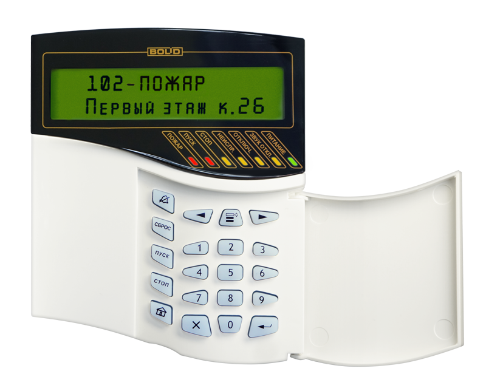
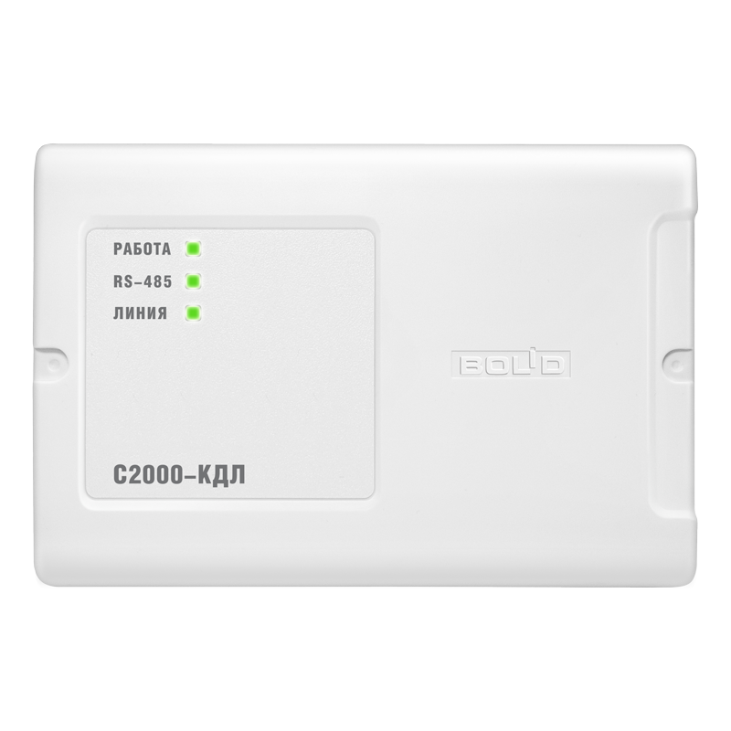
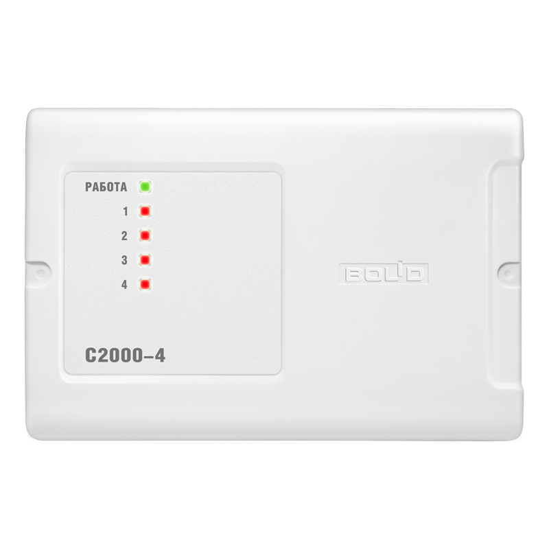
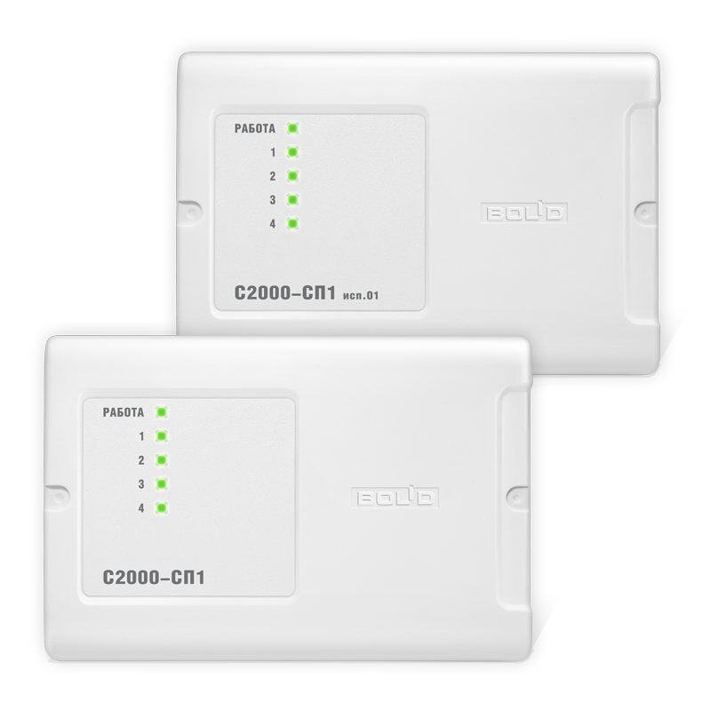

# boy_next_door

## Описание
> Привет, дружок-пирожок.  Билли закрылся в <b style="color:#0077FF">GYM</b> и не может выйти.  Помогите Билли выйти из <b style="color:#0077FF">GYM</b> и получите свои <b style="color:#0077FF">THREE HUNDRED BUCKS</b>.  
Это задание можно решить только находясь очно на площадке.  Задание находится в библиотеке. Для решения используйте преобразователь интерфейсов <b>С2000-USB</b>

Автор: [fezwect](https://t.me/fezwectf)

## Приборы

# Решение

Для того чтобы открыть электрозамок, вам нужно было изменить начально состояние реле, к которому был подключён электрозамок.
Для этого установливаем ПО с официального сайта ([нажми меня нежно](https://bolid.ru/production/orion/po-orion/po-config/)).

Так как вам нужно управлять настройками не `С2000М`, то из всего предложенного списка вам нужен [Uprog](https://bolid.ru/production/orion/po-orion/po-config/uprog.html). 

После установки ПО нужно было подключить преобразователь интерфейсов `С2000-USB` (был в библиотеке), к соответсвующим контактам (А и В), то есть контакт А на приборе и контак А на преобразователе. 

После того, как преобразователь подключен и ПО готово, нужно перевести С2000М в режим программирования, для этого переходим к пункту "**НАСТРОЙКИ**" на самом приборе (работаем ручками). 

Будет спрашиваться пароль для перехода в настройки. По умолчанию пароль "**123456**", его можно было найти в руководстве по эксплуатации. Пароль введён, а значит можно действовать дальше. 

Выбираем пункт "**РЕЖИМ ПРОГРАММИРОВАНИЯ**". Следующие действия происходят в [Uprog](https://bolid.ru/production/orion/po-orion/po-config/uprog.html). 
Для изменения начального состояния реле, считываем конфигурацию из `С2000-СП1` и изменяем параметр начального состояния 1-го реле, т.к. к нему был подключён замок. Замок открылся, флаг ваш.

`flag: surctf_b055_0f_thi5_gym`
