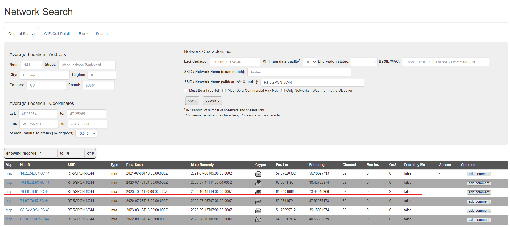
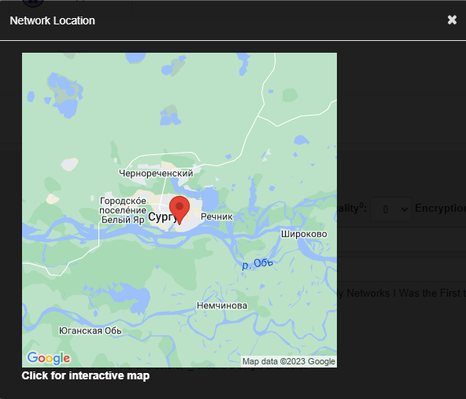

# Find me if you can

## Описание
> Случайно записал видео, но забыл, где я это сделал, помогите найти  <a style="color:#0077FF" href="screencast.mp4" >Видео</a><a style="color:#0077FF" href="http://checker.punchclub.ru:2022/" >Чекер</a>

Автор: [@blender187](https://t.me/blender187)

## Анализ видео
В предоставленном [скринкасте](screencast.mp4) можно заметить на последней секунде wifi, к которому подключен наш злоумышленник. Попробуем вычислить, где находится его точка доступа. По поиску `wifi geolocation` мы нашли сайт [WiGLE](https://wigle.net/).

Далее раскроем расширенный поиск и в поле `Network Name` введем название wifi сети `RT-5GPON-6C44`

Результат поиска:

В 3-ей строчке мы можем заметить, что роутер находится в Сургуте. Возьмем эти координаты `61.2401886, 73.44016266` и введем в чекер.

Отлично, флаг получен.

`flag: surctf_thx_w1ggl3`