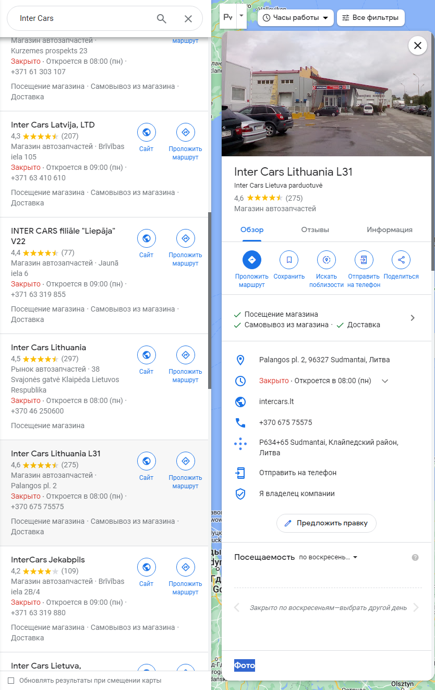
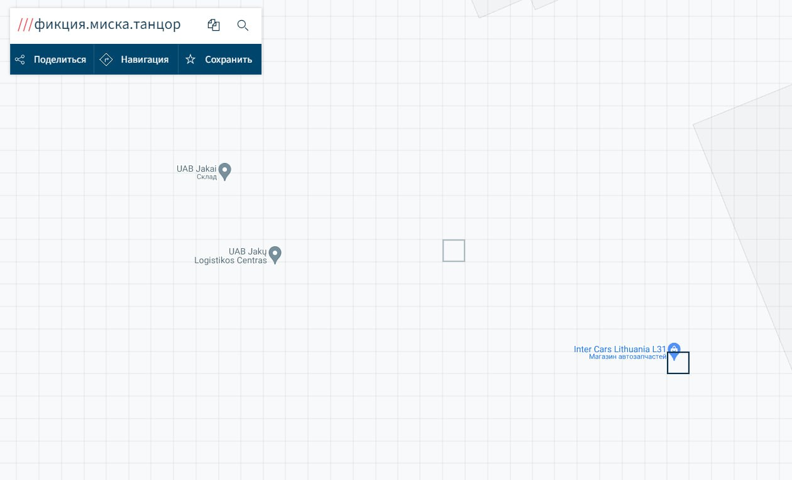

# New geocoding

## Описание
> Был потерян очень важный груз! После того как он покинул Россию его местонахождение неизвестно. Есть случайно фото, на котором он был замечен. Срочно найдите это место!  Введите в чекер «новые координаты», чтобы получить флаг, ведь мы используем новое геокодирование.  <a style="color:#0077FF" href="https://files.punchclub.ru/file/osint_photo.jpg" >Место</a><a style="color:#0077FF" href="http://checker.punchclub.ru:2021/" >Чекер</a>
> 
> HINT: Нужно искать магазин рядом с которым стоит автомобиль

Автор: [@blender187](https://t.me/blender187)

## Анализ фото

На данном фото мы можем заметить магазин `Inter Cars`. Найдем это место на картах:

Также в задании написано про какое-то `новое геокодирование`. Попробуем найти информацию в интернете. Первые ссылки отсылают нас на сайт [what3words](https://what3words.com). Найдем полученное место ранее на этой карте:

Получаем три слова: `фикция.миска.танцор`.

Введем данные три слова в чекер.

Отлично, флаг получен.

`flag: surctf_l0st_car_f0und`