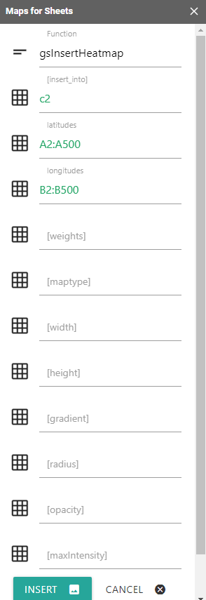
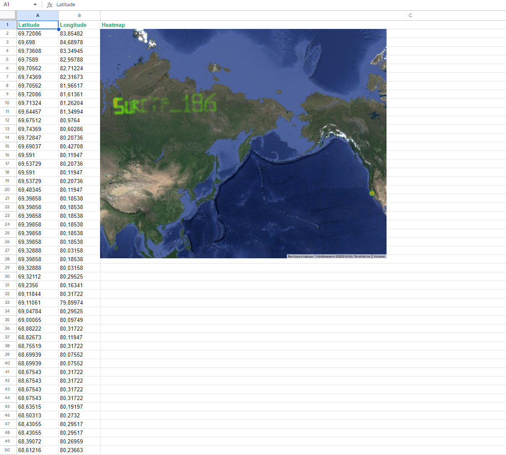

# Old geocoding

## Описание
> Понятия не имею, что значит эта куча координат.  <a style="color:#0077FF" href="task.xlsx" download>Файл</a>

Автор: [@blender187](https://t.me/blender187)

## Анализ файла

В данном файле мы видим кучу каких-то координат. Скорее всего это какой-то путь или что-то в этом роде. Можем попробовать отобразить все эти точки на карте, например с помощью расширени "Карты для таблиц" в Google документах:

Вставим тепловую карту:

На карте мы можем увидеть флаг.

Отлично, флаг получен.

`flag: surctf_186`
