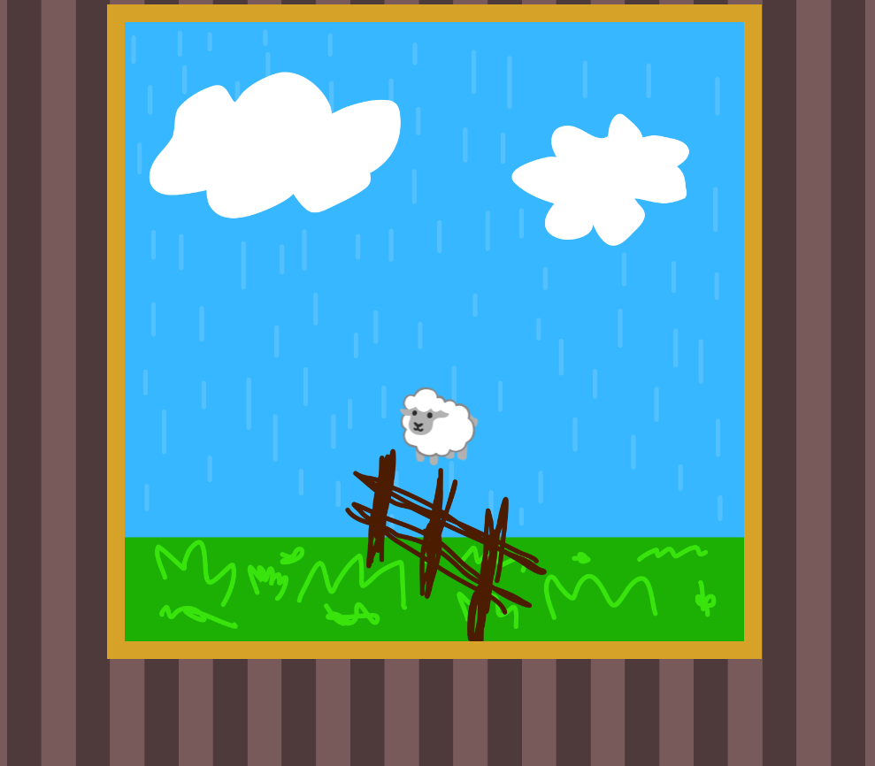

# Бессонница

## Сетап

Мы имеем странный сайт, где можно наблюдать прыгающие эмодзи волков и овечек (на разных системах эмодзи выглядели по-разному, вероятно лучший экспириенс был на MacOS)



Как сказал один из организаторов, “Овечки прыгают, волки прыгают, все в шоке” (последнее слово отредактировано)

Наблюдать за этим можно конечно вечно, но спустя 5 минут наблюдения нас ждёт довольно философский вопрос:


Причём помимо того, что мы не считали овец, а цвет текста выдавливает слезу в прямом смысле, вопрос может звучать иначе:


Чтож, здесь рождается самый ~~тупой~~ очевидный метод решения.

## Метод 1: Заставь ближнего страдать

Ну, думаю здесь всё понятно:

1. Садим человека перед монитором с листком и ручкой или счётчиком.
2. Заставляем его считать одно из животных.
3. ???
4. PROFIT.

P.S. Если вы действительно решили это именно так, мне жаль ваши глаза.

## Метод 2: Чуть по-умнее

Итак, если копнуть глубже, можно увидеть в коде страницы такое:


Здесь мы видим скрипт, который создаёт клиент на вебсокетах и в зависимости от сообщений меняет `div` с `id=“message”`. Это значит, что все эти овцы и волки отправляются нам по вебсокетам.

Смотрим, что у нас творится во вкладке Network:


Ну, вот и наши сообщения. Если сильно хочется, можно посчитать уже тут.

## Метод 3: Если вы сделали примерно так, моё уважение

А теперь, если мы умеем читать категорию таска, то понимаем, что путь к спасению наших глаз - тёмная тема в любимой IDE.

Нам надо написать скрипт, который будет работать по следующему алгоритму:

1. Подключаемся по вебсокетам к серверу и отправляем сообщение `“Connected”`;
2. Получаем все сообщения, считая количество элементов;
3. В зависимости от последнего сообщения отправляем нужное число;
4. Получаем флаг.

Адрес сервера остаётся таким же, лишь добавляем протокол `ws://` и роут `/ws/{client_id}`

`client_id` - просто timestamp.

Самый бесшовный и относительно безболезненный способ - модифицировать JS-скрипт:

```jsx
let sheep = 0
let wolf = 0
ws.onmessage = function (event) {
    let message = event.data;
    if (message.toString().includes("🐑")) {
        sheep+=1;
    }
    else if (message.toString().includes("🐺")) {
        wolf+=1;
    }
    console.log(message)
}
```

Теперь можно запустить функцию `start()` и наблюдать уже консоль, а на философский вопрос наш ответ:

```jsx
ws.send(sheep.toString())
// Или
ws.send(wolf.toString())
```

И наконец мы с минимальными усилиями получаем флаг:

`surctf_i_dr34m_ab0ut_w3bs0cket5_h3lp_m3`
