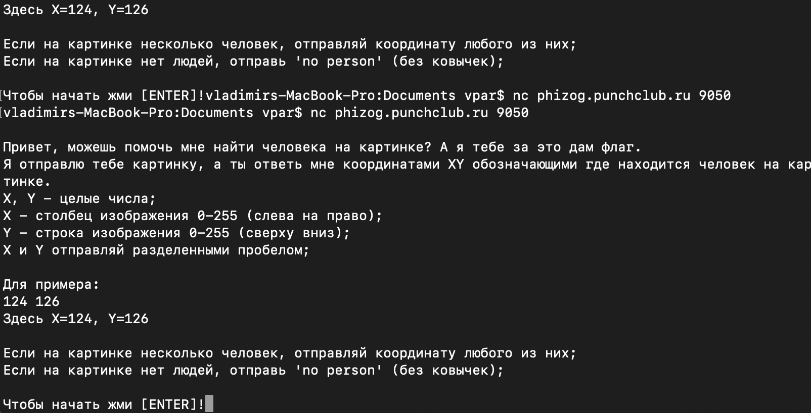

# help_dora

Подключаемся к сокету с помощью неткэта(или еще чего другого), видим условие таска:


Далее, нажав ENTER, мы увидим что сервис отправил нам картинку закодированную в base64. В целом, объяснять что-то тут не вижу смысла, таск решается достаточно просто, нужно только найти нейронку(yolov8n в моем случае) и запрогать.
Я написал скрипт, который отображает картинки и задетекченые боксы людей в отдельном окне с помощью opencv.
Зеленым рисую бокс, красная точка - отправляемая координата, середина бокса.  

  

Код [скрипта](solve.py):
```python
import numpy as np
import cv2
from ultralytics import YOLO
import base64
from pwn import *

cv2.startWindowThread()

conn = remote('194.26.138.228', 9050)

yolo = YOLO("yolov8n.pt")

conn.sendline(b"")
print(conn.recvuntil(b"IMG: ").decode("utf-8"))

try:
    while True:
        img = conn.recvuntil(b"ANSW: ", drop=True).strip()
        img = np.frombuffer(base64.b64decode(img), dtype=np.uint8)
        img = cv2.imdecode(img, cv2.IMREAD_COLOR)

        result = yolo(img, verbose=False)[0]
        boxes = np.array(result.boxes.xyxy, dtype="int")

        persons = []
        for i, xyxy in enumerate(boxes):
            if result.boxes.cls[i] != 0:  # only persons
                continue

            xyxy = tuple(map(int, xyxy))
            persons.append(xyxy)

            cv2.rectangle(img, xyxy[:2], xyxy[2:], (0, 255, 0), 2)

        if len(persons) == 0:
            answ = b"no person"
        else:
            x = (persons[0][0] + persons[0][2]) // 2
            y = (persons[0][1] + persons[0][3]) // 2
            cv2.circle(img, (x, y), 0, (0, 0, 255), 3)
            answ = f"{x} {y}".encode("utf-8")

        print("SENDING:", answ.decode("utf=8"))
        cv2.imshow("image", img)
        k = cv2.waitKey(1)
        if k & 0xFF == ord("q"):
            break

        conn.sendline(answ)

        print("RESULT:", conn.recvuntil(b"IMG: ").decode("utf-8"))
except Exception as e:
    conn.interactive()
finally:
    cv2.destroyAllWindows()
    pass
```

После обработки всех изображений получаем вот такой вывод:  
  
Для получения флага было необходимо набрать хотя бы 85% верных ответов. Координатой человека могла быть любая точка попадающая в задетекченный бокс, очевидно, что оптимальнее всего было бы отправлять середину бокса.  
`flag: surctf_gratz_you_solv3d_1t_n0w_y0u_ar3_ml_3ng1n33r`