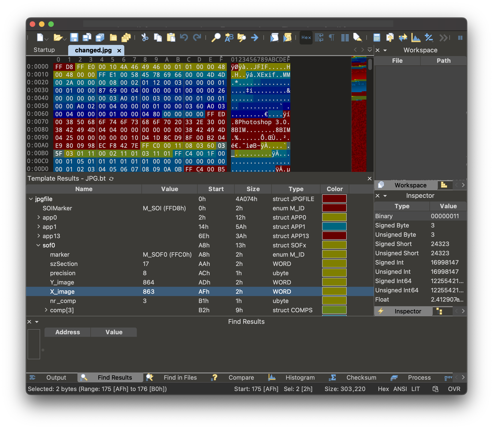
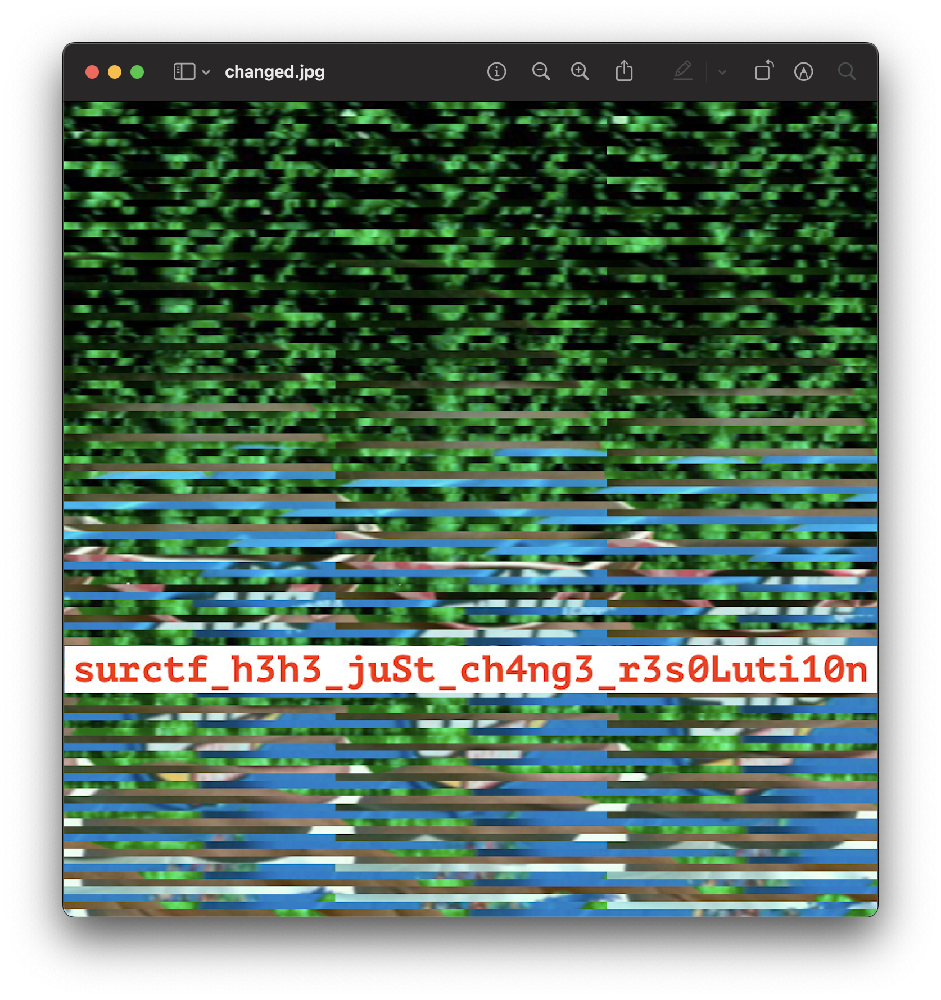

# broken_picture

В середине картинки мы видим что-то похожее на текст, но он сломан и не понятно что там написано. Также мы видим небольшие отступы у блоков с текстом, давайте найдем длину такого блока:  

Получается длина блока около 863 пикселей. Теперь давайте сменим ширину картинки с 1152 на 863. Для этого можно использовать `010 Editor`:  

Теперь смотрим что у нас получилось:  

`flag: surctf_h3h3_juSt_ch4ng3_r3s0Luti10n`
