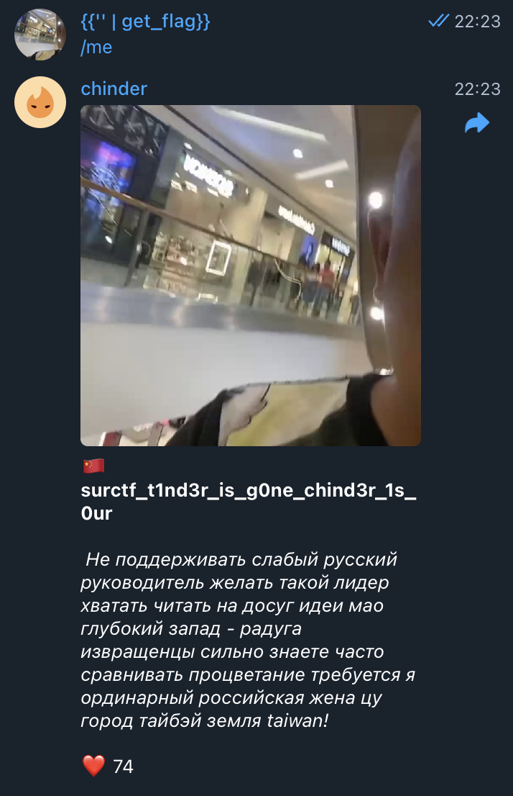

# chinder
В исходниках таска видем интересную деталь - сообщения рендерятся с помощью jinja templates и рендерятся неверно:
```python
jinja_env = Environment()
jinja_env.filters["get_flag"] = get_flag

CARD_TEMPLATE = """
🇨🇳 <b>{name}</b>

<i> {bio} </i>

❤️ {likes}
"""
```

```python
    user_card: Card = await get_user_card_and_update_photo(msg.from_user, user_photo)

    answ = jinja_env.from_string(
        CARD_TEMPLATE.format(
            name=user_card.name,
            bio=user_card.bio,
            likes=user_card.likes
        )
    )

    await msg.answer_photo(
        photo=user_card.photo,
        caption=answ.render(),
        parse_mode="HTML"
    )
```

Вместа подстановки значений для полей {name}, {bio}, {likes} через вызов методы .render(), это происходит с помощью дефолтного форматирования в python через .format(), что создает возможность для [SSTI](https://book.hacktricks.xyz/pentesting-web/ssti-server-side-template-injection/jinja2-ssti).  
Видим, что единственное поле на которое мы можем воздействовать - это поле name, которое берется из first_name в тг. 
Пробуем подставить туда инъекцию кода жинжы `{{ '' | get_flag }}`, и вызывает фильтр `get_flag`, таким образом получаем флаг.  
  

`flag: surctf_t1nd3r_is_g0ne_chind3r_1s_0ur`
