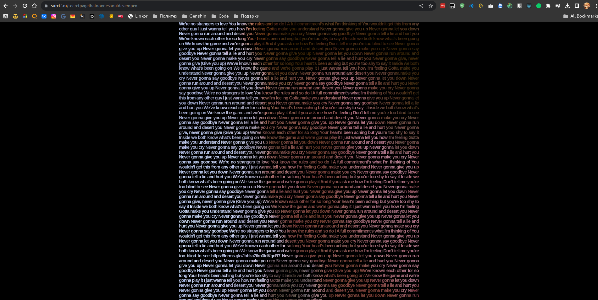
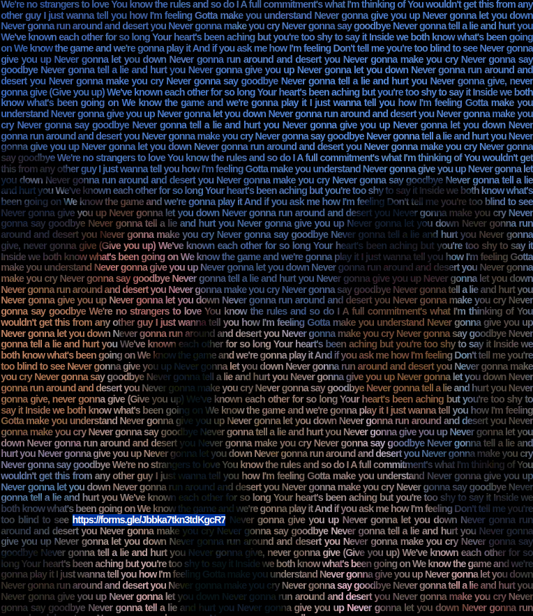

# Registration

## Описание

> Вы просили - мы сделали! Предоставляем вам совершенно новую, инновационную регистрацию. В сто раз лучше, в сто раз мощнее предыдущей и почти без дырок. Почти...<br><br><a href="https://surctf.ru/" >Ссылка на ту самую регистрацию</a>

Автор: [cornael](https://t.me/cornael)

## Анализ сайта

Зайдем на сайт регистрации, перейдя по ссылке. Из-за того что регистрация окончена, все старые ссылки и кнопки кроме /team не работают. Заглянем в файл [robots.txt](https://surctf.ru/robots.txt):

```
# https://www.robotstxt.org/robotstxt.html
User-agent: *

Disallow: /register
Disallow: /login
Disallow: /team
Disallow: /register/captain
Disallow: /secretpagethatnooneshouldeveropen
Disallow: /captain
```

Мы видим путь `/secretpagethatnooneshouldeveropen`, который нигде не афишировал и выглядит очень подозрительно. Зайдем по этой [ссылке](https://surctf.ru/secretpagethatnooneshouldeveropen):



Мы видим кучу текста, которая является текстом песни [Rick Astley - Never Gonna Give You Up](https://www.youtube.com/watch?v=dQw4w9WgXcQ&ab_channel=RickAstley). И если ее скопировать и внимательно посмотреть то можно заметить ссылку на [гугл-форму](https://forms.gle/Jbbka7tkn3tdKgcR7):



Зайдем на данную гугл-форму и заполним ответы:

```
Спасибо за ваш отзыв. Вот ваш флаг: surctf_th4nk_u_f0r_reg1st3ring
```

Отлично, флаг получен.

`flag: surctf_th4nk_u_f0r_reg1st3ring`
