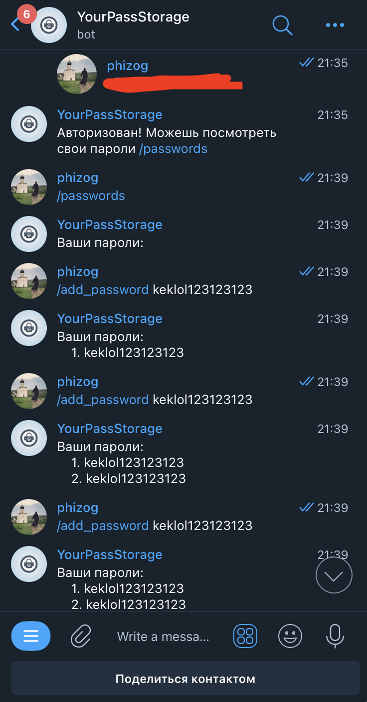
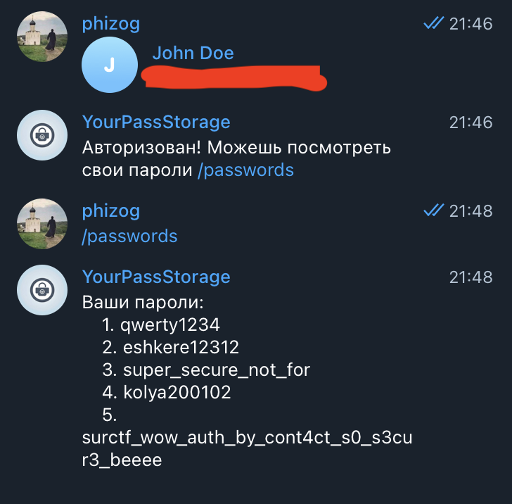

# YourPassStorage
Заходим в [бота](https://t.me/urpassstoragebot).  
Бот просит нас авторизоваться в него через отправку контакта, отправляем, авторизуемся, видим что можем добавлять пароли.
Пробуем добавить несколько паролей и узнаем что есть ограничение в пять паролей.  

  


В сообщении об ограничении видим контакт админа [@cooldoor](https://t.me/cooldoor). Пока не ясно что нам это дает.

Лезим в исходники приложенные к таску(но в целом до этого можно было и без исходников догадаться).
Авторизация юзера происходит по его контакту и бот никак не валидирует, принадлежит ли контакт именно тому юзеру с которым идет диалог:
```python
@dp.message(F.contact)
async def on_contact(msg: types.Message):
    user_id = msg.from_user.id
    user = User.select().where(User._id == user_id).get_or_none()

    phone = msg.contact.phone_number.replace("+", "").replace(" ", "").replace("(", "").replace(")", "")
    if user is None:
        user = User.create(_id=user_id, phone=phone).get_or_none()

    if user is None:
        await msg.answer(f"Какие-то проблемы, пингани @phizog")
        return

    logging.info(phone)

    User.update(phone=phone).where(User._id == user._id).execute()

    await msg.answer(f"Авторизован! Можешь посмотреть свои пароли /passwords")
```

Пробуем переслать боту контакт админа([@cooldoor](https://t.me/cooldoor)), бот нас авторизует, вызываем /passwords, получаем флаг:    
  

`flag: surctf_wow_auth_by_cont4ct_s0_s3cur3_beeee`
